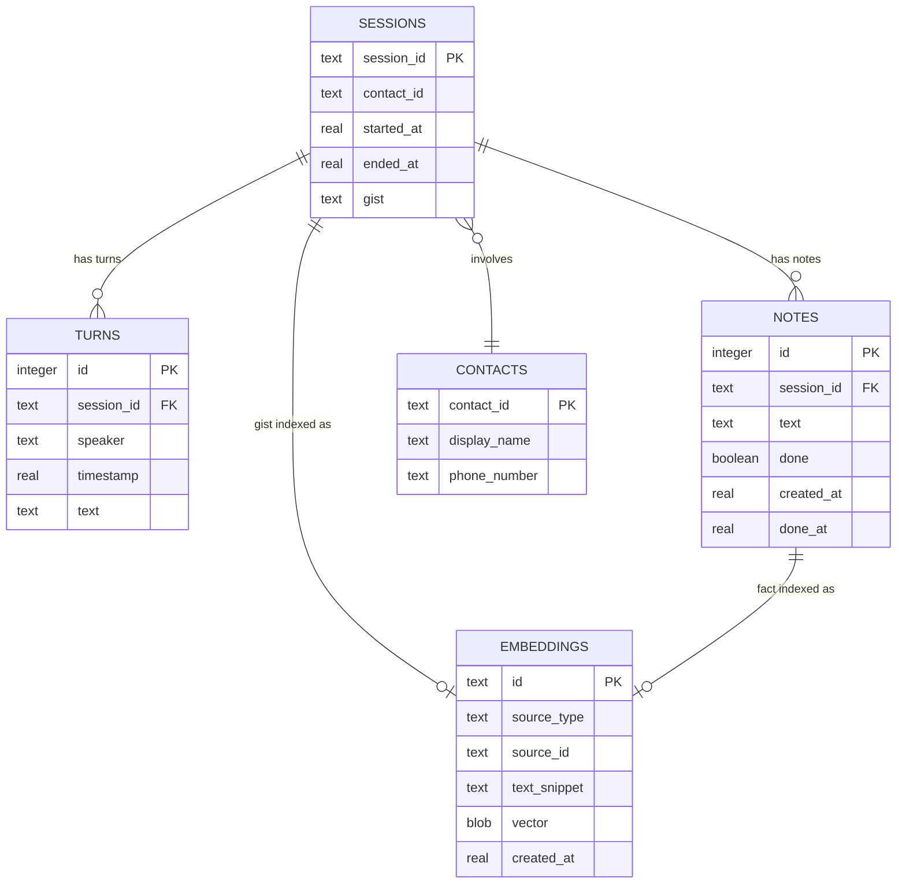
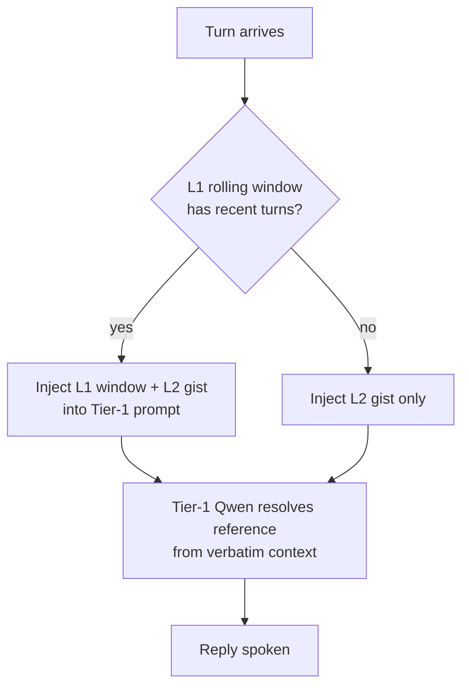
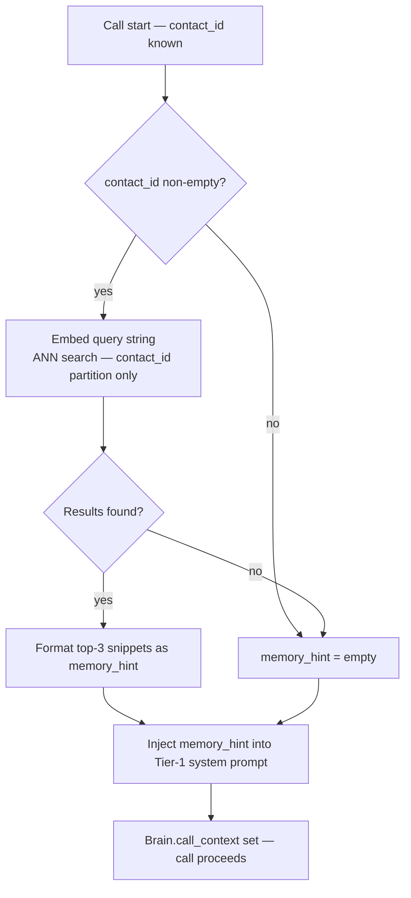
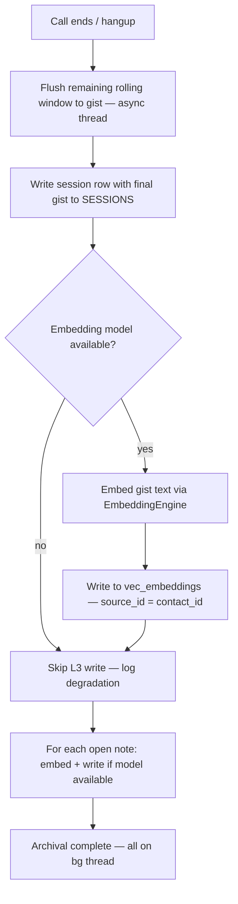
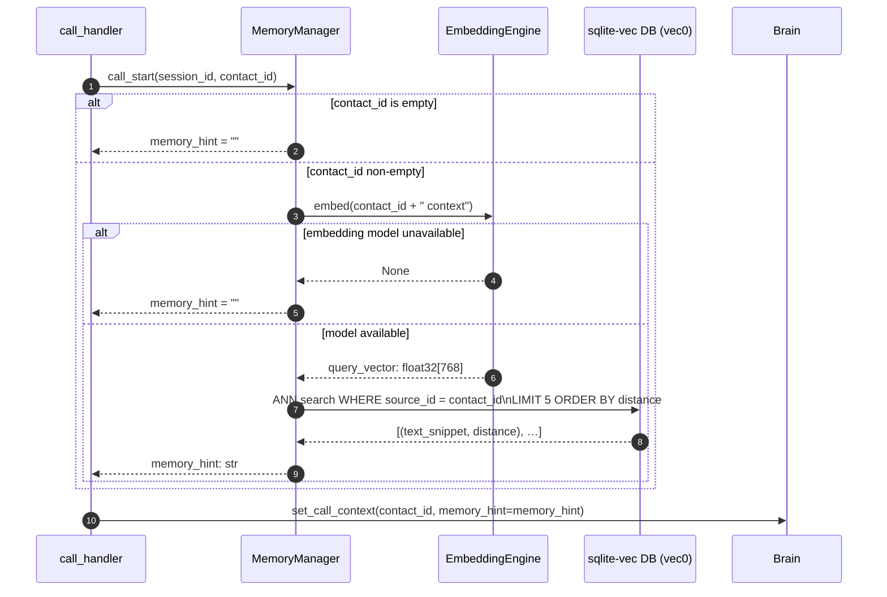
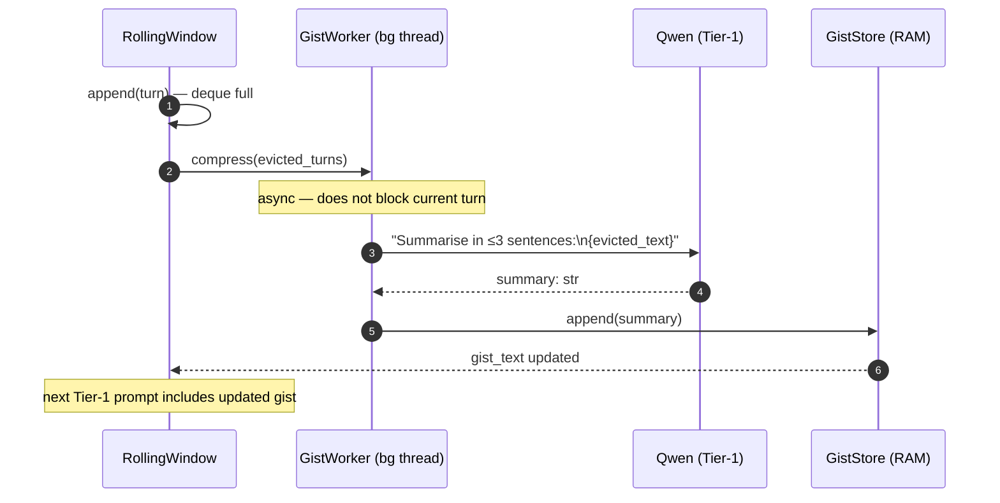

# ADR-0003 — Memory Architecture: Three-Layer Tiered Store with sqlite-vec Semantic Recall

- **Status:** proposed (2026-06-16)
- **Bead:** ti-wc2 (design), ti-kfga (this document — reviewer-requested gaps)
- **Related:** [ADR-0001](0001-no-mcp-direct-api-via-qwen.md) (no MCP, local direct-API), [ADR-0002](0002-capability-gating-by-speaker-channel.md) (privacy / trust boundaries), ADR-0005 (contact roster — bead ti-tkaj), [ARCHITECTURE.md §7](../ARCHITECTURE.md)

---

## Context

Iris needs memory at three time horizons:

1. **Immediate** (sub-second, within a turn) — verbatim recent turns so references like "that thing" resolve.
2. **Session** (minutes, across a long call) — a compressed summary so Iris stays coherent without holding the full transcript in the LLM context window.
3. **Cross-call** (days/weeks) — semantic recall of what was discussed in past calls with a given contact.

v1 shipped `transcript.py` (SQLite append-only log), `notes.py` (JSON-file notes), and `prefs.py` (per-contact tone preferences). The two-tier in-call context (rolling window + gist) and the sqlite-vec L3 layer were not built.

This ADR decides the architecture for the memory layer the builder is now implementing in `iris/memory.py`.

---

## Requirements

| ID | Requirement |
|----|-------------|
| FR-01 | Within a live call, Iris must resolve references to the last few minutes verbatim |
| FR-02 | Across a long call (>10 min), Iris must stay responsive without holding the full transcript in the LLM context window |
| FR-03 | Across calls, Iris must recall what was discussed with a given contact in past calls |
| FR-04 | At call start, Iris must inject relevant past context into the model prompt automatically |
| FR-05 | Notes and facts extracted during a call must be retrievable in later calls |
| NFR-01 | Mid-turn latency for context retrieval must not degrade the 32 ms TTFT target (Tier-0/1 path) |
| NFR-02 | All call content, embeddings, and derived artifacts stay local — never sent to a hosted service the operator didn't opt into |
| NFR-03 | Zero extra infrastructure: no daemon, no separate port, no container beyond what SQLite provides |
| NFR-04 | Each layer must be independently testable |

---

## Decision

**The vector semantic-recall layer COMPLEMENTS and WORKS TOGETHER with the shipped context-tier design. It does not replace the rolling-window + gist.**

The two mechanisms address different problems on different time horizons and are connected by a specific pipeline: the gist is the unit that bridges in-call compression to cross-call indexing.

---

## Architecture: Three Layers

```
┌─────────────────────────────────────────────────────────────────────────┐
│                       MEMORY ARCHITECTURE                                │
│                                                                          │
│  Time horizon   Layer            Storage        Latency    Persistence  │
│  ─────────────  ───────────────  ─────────────  ─────────  ──────────── │
│  Immediate      L1: Rolling      RAM (deque)    <0.1 ms    call-scoped  │
│  (<5 min)       Window                                                   │
│                                                                          │
│  Session        L2: Running      RAM → SQLite   <1 ms      call-scoped  │
│  (full call)    Gist             (on flush)     read                    │
│                                                                          │
│  Cross-call     L3: Vector       sqlite-vec     5–50 ms    persistent   │
│  (days/weeks)   Index            (same DB file) at         (forever)    │
│                                  as transcript  call-start               │
│                                                 only                    │
└─────────────────────────────────────────────────────────────────────────┘
```

### L1 — Rolling Window (RAM)

A cyclic deque of the last N raw turns (target: 20–30 turns, ~5 min of speech). Verbatim `(speaker, timestamp, text)` triples. No model inference. Flushed to L2 when it overflows; also written to `TranscriptStore` on every append.

### L2 — Running Gist (RAM → SQLite)

When the rolling window compresses (oldest turns evicted), Qwen produces a ≤3-sentence summary on a background thread. The gist accumulates across the call. At call end, the final gist is written to SQLite and indexed into L3. **This is the bridging artifact** — L2 gist → L3 embedding.

### L3 — Vector Index (sqlite-vec vec0)

Embeddings of: call gists, extracted notes/facts, contact preference summaries. Queried once at call start (keyed on `contact_id`); results injected as `memory_hint` into Tier-1's system prompt. Never queried mid-turn.

---

## L3 Substrate: sqlite-vec with vec0 Virtual Table

### Why sqlite-vec

| Factor | sqlite-vec | LanceDB | Mem0 / Letta |
|--------|-----------|---------|-------------|
| Extra infra | None — SQLite extension | Separate file format | Cloud-first / local daemon |
| Same DB file as transcript | Yes | No | No |
| Privacy | Same boundary as raw transcript | Separate file | External service (default) |
| Hybrid text+vector query | Yes — JOIN with transcript tables | No | No |
| Operational complexity | Near-zero | Low | Medium–High |
| License | Apache-2.0 | Apache 2.0 | Commercial |
| Deployment | `pip install sqlite-vec` | `pip install lancedb` | Complex |

The decisive factor: co-location. Embedding + transcript live in the same SQLite file, enabling JOIN queries without cross-process coordination.

### vec0 virtual table (DECISION)

The implementation uses the **vec0** virtual table, not the older vec1:

```sql
CREATE VIRTUAL TABLE IF NOT EXISTS vec_embeddings USING vec0(
    source_id     TEXT PARTITION KEY,
    source_type   TEXT,
    text_snippet  TEXT,
    embedding     float[768]
);
```

**Why vec0 over vec1:**
- vec0 is the current stable API for sqlite-vec (≥ 0.1.6). vec1 is retained for compatibility but new code targets vec0.
- vec0 supports the `PARTITION KEY` annotation, which is critical for contact-partitioned queries (see privacy model below).
- vec0 uses IVF-style incremental indexing — insert-time cost is low; no explicit index rebuild needed at call volumes.
- vec0's distance function defaults to **cosine** for float vectors — correct for normalized sentence embeddings.

**Explicit extension load (required):**

```python
conn = sqlite3.connect(db_path)
conn.enable_load_extension(True)
try:
    conn.load_extension("sqlite_vec")   # path from cfg.sqlite_vec_path or system default
    _vec_available = True
except (ImportError, sqlite3.OperationalError):
    _vec_available = False              # graceful degradation path — see below
conn.enable_load_extension(False)       # lock down after loading
```

Never rely on SQLite autoload. The `enable_load_extension(False)` call after loading closes the extension-load surface immediately.

**Dimension:** 768 floats, matching nomic-embed-text-v1's output dimensionality. The dimension is validated against `cfg.embedding_dim` at startup; a mismatch raises a clear error rather than silently inserting wrong-dimension vectors.

---

## Embedding Model: nomic-embed-text-v1 (DECISION)

### Selection

| Model | Dim | Size | Source | Latency (est.) | License |
|-------|-----|------|--------|----------------|---------|
| **nomic-embed-text-v1** | **768** | **22M params** | **llama.cpp local** | **5–20 ms** | **Apache 2.0** |
| all-MiniLM-L6-v2 | 384 | 22M params | sentence-transformers | 5–15 ms | Apache 2.0 |
| OpenAI text-embedding-3-small | 1536 | cloud | OpenAI API | 50–200 ms | commercial |
| mxbai-embed-large-v1 | 1024 | 335M params | llama.cpp local | 20–60 ms | Apache 2.0 |

**Decision: nomic-embed-text-v1** (via llama.cpp, same server as Qwen).

Rationale:
1. **Same server process.** llama.cpp `--model`-slots can load multiple models. nomic runs in the same llama-server as Qwen, so no separate embedding daemon, no extra port, no additional warmup cost.
2. **768 dimensions** matches vec0's float[768] column and the MTEB semantic search benchmark sweet spot for retrieval quality vs. latency.
3. **22M params** — fast. Estimated 5–20 ms inference on the target AMD Strix Halo APU iGPU. Acceptable at call-start (not on the mid-turn hot path).
4. **nomic-embed-text GGUF** is widely available; quantized to Q4_K_M is ~14 MB — trivial alongside Qwen's 4 GB.
5. **Designed for RAG/retrieval** — nomic-embed-text was specifically optimized for asymmetric retrieval (query vs. document), which matches our use case (query = contact + current turn text, document = past call gists).
6. **ADR-0001 compliance** — local inference, never touches the cloud.

**Fallback:** `all-MiniLM-L6-v2` via sentence-transformers if llama.cpp is unavailable. Uses `embedding_dim=384` and a separate `vec_embeddings_minilm` table (or the same table if the dimension config matches). The builder should use `cfg.embedding_model` / `cfg.embedding_dim` to branch — no hardcoded model names.

**Cloud embedding is opt-in only** and violates NFR-02 by default. It is behind the same `MemoryProvider` abstraction; the concrete default is always local.

---

## Privacy Model: contact_id Partitioning (DECISION)

This is the most critical security property of L3.

### The rule

**Every L3 query is filtered by `contact_id`. No cross-contact queries ever.**

```python
# CORRECT — always partition by contact
results = conn.execute(
    "SELECT text_snippet, distance FROM vec_embeddings "
    "WHERE source_id = ? "
    "AND embedding MATCH ? ORDER BY distance LIMIT ?",
    (contact_id, query_vec, top_k)
).fetchall()

# WRONG — never do a cross-contact query
results = conn.execute(
    "SELECT text_snippet, distance FROM vec_embeddings "
    "WHERE embedding MATCH ? ORDER BY distance LIMIT ?",
    (query_vec, top_k)
).fetchall()  # ← would reveal info from other contacts' calls
```

The `source_id` column in vec0 is declared as `PARTITION KEY`, which is a vec0-level optimization that physically co-locates rows with the same `source_id`. This makes contact-filtered queries faster AND makes the partitioning semantically explicit to any reader of the schema.

### Why this matters

Iris has calls with many people. The vector space can surface surprising cross-contact semantic matches — "what was discussed about the dentist" might return a fragment from a call with a family member if the query is only semantic similarity without a contact filter. That would be a privacy violation: Iris revealing information from one relationship context in another.

The contact_id boundary IS the privacy partition. A query for contact A never returns artifacts from contact B's calls, even if they're semantically similar.

### Unknown caller

When `contact_id` is the empty string (unknown/unresolved caller), the L3 query is a **no-op** — `call_start` returns `memory_hint = ""`. Do not issue a query with `source_id = ""` against the vec0 table; skip the query entirely.

```python
def call_start(self, session_id: str, contact_id: str) -> str:
    if not contact_id:
        return ""   # no L3 for unknown callers
    # ... embed and query
```

### contact_id format

`contact_id` is the UUID from the roster (ADR-0005). For the EMBEDDINGS table, `source_id` holds this UUID. The SESSION_ID is a separate field linking sessions to contacts, but it is the `contact_id` that is the L3 query key.

---

## Graceful Degradation Path (DECISION)

L3 (and the embedding model) are optional. The memory architecture degrades gracefully at two points:

### Degradation 1: sqlite-vec extension unavailable

If `conn.load_extension("sqlite_vec")` raises `ImportError` or `OperationalError`:

- `_vec_available = False`
- `insert_embedding()` is a no-op (logs a debug message, does not raise)
- `call_start()` skips the vec0 ANN query and returns `memory_hint = ""`
- L1 (rolling window) and L2 (gist) continue to function fully
- At startup, log: `[memory] sqlite-vec not available; L3 vector recall disabled. Install with: pip install sqlite-vec`

**FTS5 fallback (optional, v1 scope TBD):** An alternative degradation is to run FTS5 over `turns.text` as a keyword-based memory_hint. This is viable but adds complexity and is deferred unless the operator explicitly opts in. The `MemoryProvider` interface accommodates it: return FTS-matched snippets from `recent_for_contact` as the memory_hint. Do NOT implement this in v1 unless the bead explicitly calls for it.

### Degradation 2: embedding model unavailable

If the embedding model can't be loaded (wrong path, insufficient VRAM, not configured):

- `EmbeddingEngine` returns `None` on `embed()`
- `insert_embedding()` treats a `None` embedding as a no-op (silent skip, no error)
- `call_start()` cannot query L3 → returns `memory_hint = ""`
- L1 and L2 still function; only cross-call semantic recall is disabled
- Log at startup: `[memory] Embedding model not available; L3 recall disabled. Set cfg.embedding_model to enable.`

### Degradation invariant

**Degraded != broken.** Iris must function fully on L1 + L2 regardless of L3 state. A missing sqlite-vec or embedding model is a capability reduction, not a startup failure. Do NOT raise in `__init__` or at startup if L3 is unavailable.

---

## Data Model



The `EMBEDDINGS` table is mirrored by a `vec0` virtual table for ANN search. The `vector` column is a float32 blob. The `source_type` / `source_id` pair links back to the originating artifact.

**Schema invariants the builder must enforce:**
- `SESSIONS.contact_id TEXT NOT NULL` — no anonymous sessions. An unknown caller must be given a synthetic contact_id (e.g. the caller's raw phone number as a placeholder) or the session deferred until the contact resolves.
- `EMBEDDINGS.contact_id TEXT NOT NULL` — partition key cannot be NULL.
- `EMBEDDINGS.text_snippet` truncated to 200 characters at insert time (`text[:200]`).

---

## Use Cases

### UC-01: Within-call Reference Resolution



### UC-02: Cross-call Recall at Call Start



### UC-03: Call End Indexing



---

## Action Flows

### AF-01: Call-Start Memory Injection



1. `call_handler` fires `call_start` as soon as the call connects and `contact_id` is resolved from the roster.
2. If `contact_id` is empty (unknown caller), skip L3 entirely — `memory_hint` is the empty string.
3. `EmbeddingEngine` uses `nomic-embed-text-v1` via the llama.cpp server. If the model is unavailable, it returns `None`; `MemoryManager` handles `None` as a no-op and returns an empty hint.
4. The vec0 ANN search is **always filtered by `source_id = contact_id`**. No cross-contact results ever appear.
5. Top-5 results, formatted as 2–4 sentences, become `memory_hint`. The hint is injected once into `Brain`'s Tier-1 system prompt and remains immutable for the call duration.

### AF-02: Rolling-Window Gist Compression



1. When the rolling-window deque overflows, evicted turns are handed to `GistWorker` on a background `daemon=True` thread.
2. Qwen produces a ≤3-sentence summary — ~10–20 tokens output, fast.
3. The running gist in RAM is atomically updated. The next Tier-1 turn sees the refreshed gist header.

### AF-03: Call-End Archival to L3

```mermaid
sequenceDiagram
    autonumber
    participant TH as call_handler
    participant MM as MemoryManager
    participant QW as Qwen (Tier-1)
    participant EE as EmbeddingEngine
    participant DB as SQLite (SESSIONS + vec0)

    TH->>MM: call_end(session_id)
    Note over MM: All on bg thread — hangup not blocked
    MM->>QW: "Final call summary:\n{gist + last_turns}"
    QW-->>MM: final_gist: str
    MM->>DB: SESSIONS.update(session_id, gist=final_gist, ended_at=now)
    alt EmbeddingEngine available
        MM->>EE: embed(final_gist)
        EE-->>MM: gist_vector: float32[768]
        MM->>DB: vec_embeddings.insert(source_id=contact_id, source_type=gist,\ntext_snippet=final_gist[:200], embedding=gist_vector)
        loop for each open note
            MM->>EE: embed(note.text)
            EE-->>MM: note_vector
            MM->>DB: vec_embeddings.insert(source_id=contact_id, source_type=note, ...)
        end
    else EmbeddingEngine unavailable
        Note over MM: Log degradation; skip L3 write; gist still in SESSIONS
    end
    MM-->>TH: archival complete
```

1. `call_end` fires on `CallEnded` D-Bus signal.
2. Final gist is written to SESSIONS regardless of L3 availability — the human-readable record is durable.
3. Embeddings are written only when `EmbeddingEngine` is available. The `source_id` is always `contact_id` — the privacy partition key.

---

## Provider Interface

```python
class MemoryProvider(Protocol):
    def call_start(self, session_id: str, contact_id: str) -> str:
        """Return memory_hint for injection into Tier-1 prompts.
        
        Returns "" when contact_id is empty or L3 is unavailable.
        Must complete in < 50 ms (L3 query budget).
        """
        ...

    def append_turn(self, session_id: str, speaker: str, text: str) -> None:
        """Record a turn (durable log + rolling window)."""
        ...

    def call_end(self, session_id: str) -> None:
        """Archive gist + notes to L3; non-blocking (fires bg thread)."""
        ...
```

Config additions (to `iris/config.py`):

```python
# Memory / embedding provider
embedding_model: str = "nomic-embed-text-v1"   # GGUF model name for llama.cpp slot
embedding_dim: int = 768                         # must match model output dimension
sqlite_vec_path: str = ""                        # "" = system default sqlite-vec path
db_path: str = ""                                # "" = ~/.local/share/iris/iris.db
```

---

## Security Controls

| Control | Mechanism |
|---------|-----------|
| Privacy (ADR-0002) | All layers local; `~/.local/share/iris/iris.db` user-owned, gitignored, never committed |
| L3 contact partitioning | Every vec0 ANN query includes `WHERE source_id = contact_id` — enforced in `MemoryManager`, not just guideline |
| Embedding leakage | Embeddings stored in same file as transcript — same backup/wipe semantics; no separate export surface |
| Extension load hardening | `enable_load_extension(True)` only during load, `enable_load_extension(False)` immediately after — no persistent open surface |
| Gist injection | Gist text passes through Qwen (local) only; never reaches cloud model (Haiku is text-out only per ADR-0001) |
| memory_hint injection | Injected as system-prompt prefix, not tool output — no re-injection attack surface |

---

## Risks

| Risk | Likelihood | Impact | Mitigation |
|------|-----------|--------|------------|
| Cross-contact query (code bug) | Low | High | Lint rule / test: every `vec_embeddings` SELECT must include `source_id = ?` binding; no unbounded queries |
| sqlite-vec index rebuild time on large stores | Low | Medium | Index is incremental; rebuild only on migration; monitor at > 50k embeddings |
| Gist compression lag blocks hot path | Medium (busy box) | Medium | `GistWorker` is daemon thread; missed compression = stale gist, not broken call |
| Embedding model cold-start | Medium (first call) | Low | Load at app start alongside Qwen warmup |
| contact_id empty on session open | Medium | Low | `call_start` handles empty → no-op L3; SESSIONS DDL enforces NOT NULL |
| nomic-embed-text GGUF not installed | Medium (new deploy) | Low | Graceful degradation to empty memory_hint; startup log instructs install |

---

## Guardrails for the Builder

1. **`SESSIONS.contact_id` is `NOT NULL`** in DDL. An unknown caller must be given a synthetic ID (raw phone number as a placeholder) or the session deferred. Never insert a session row with `contact_id = NULL`.

2. **Every L3 query is contact-partitioned.** No `SELECT ... FROM vec_embeddings WHERE embedding MATCH ?` without `AND source_id = ?`. Add a test that asserts this at the unit level.

3. **`_vec_available` flag governs all L3 paths.** Check it before every insert and query. L3 paths must be behind `if self._vec_available:` — not a try/except wrapper that silently succeeds when vec is absent.

4. **Embedding model is config-swappable.** Read `cfg.embedding_model` and `cfg.embedding_dim`. Do not hardcode `"nomic-embed-text-v1"` in anything other than the config default.

5. **`GistWorker` is `daemon=True`.** It must not block on the Tier-1 completion path. If the gist queue is backed up, evict the oldest pending compression rather than blocking the turn.

6. **`text_snippet` is truncated to 200 chars at insert time.** Enforce in `insert_embedding()`, not in callers.

7. **`enable_load_extension(False)` after loading.** The extension load surface must be closed immediately after `load_extension("sqlite_vec")` succeeds.

8. **`contact_id = ""` → L3 no-op.** `call_start` must check for empty string before querying. The vec0 partition query with an empty `source_id` is meaningless and should not be issued.

---

## Trade-offs & Alternatives Considered

**Alternative 1: Replace rolling-window + gist with vector recall.**
Rejected. Vector recall is cross-call retrieval; it cannot provide recency (last 3 turns verbatim) or be queried sub-millisecond mid-turn.

**Alternative 2: Mem0 / Letta as the memory layer.**
Rejected for v1. Cloud-first by default; adds operational complexity. The `MemoryProvider` interface accommodates them as a swap-in. Deferred.

**Alternative 3: FTS5 keyword recall only (no vector).**
Viable fallback when embedding model is unavailable. FTS5 on `turns.text` is always available in SQLite. Deferred for explicit opt-in; not the default. The `MemoryProvider` interface supports returning FTS-matched snippets as `memory_hint`.

**Alternative 4: Keep gist in RAM only, don't index it.**
Rejected. The gist is the most valuable artifact of a call. Write it to SESSIONS at call end unconditionally — this is independent of L3 availability.

**Alternative 5: mxbai-embed-large-v1 for higher retrieval quality.**
Considered. 335M params / 1024 dims — better MTEB benchmarks but 15–60 ms inference and significantly larger GGUF. For cross-call recall (queried once at call start, not mid-turn), the quality difference is marginal for our use case (short call gists, not long documents). nomic-embed-text-v1 at 768 dims is sufficient; upgrade path is `cfg.embedding_model + cfg.embedding_dim`.

---

## Summary

| Question | Decision |
|----------|----------|
| Replace vs. complement vs. combine? | **Complement + work together.** Three layers, different time horizons, connected by the gist pipeline. |
| sqlite-vec — which virtual table? | **vec0** with `PARTITION KEY` on `source_id` (contact_id). |
| Embedding model? | **nomic-embed-text-v1** via llama.cpp (same server as Qwen). 768 dims, 22M params, ADR-0001 compliant. |
| Privacy partition? | **contact_id is the partition key.** Every L3 query filtered by contact_id. No cross-contact queries, ever. |
| Unknown caller? | **L3 no-op.** Empty `contact_id` → skip L3, return `memory_hint = ""`. |
| Degradation path? | **Two-level:** (1) no sqlite-vec extension → L3 disabled, L1+L2 fully operational; (2) no embedding model → L3 disabled, L1+L2 fully operational. Neither case is a startup failure. |
| When is L3 queried? | **Call-start only.** Never mid-turn. |
| Materialized as file? | **Yes — `docs/adr/0003-memory-three-layer-architecture.md`** |
